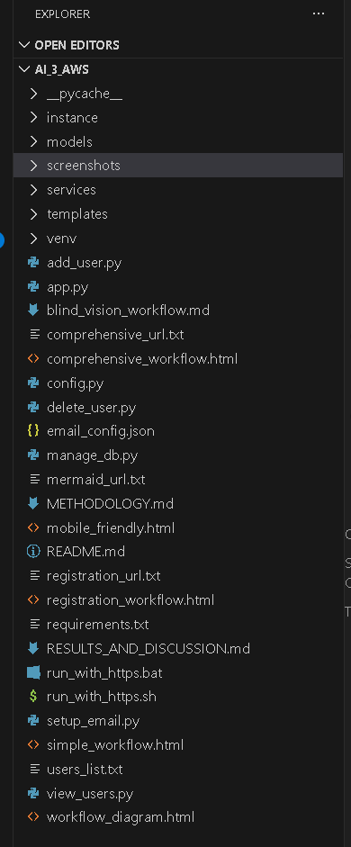
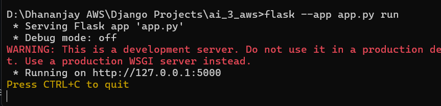
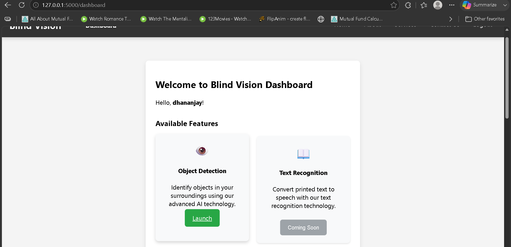

# blind_ai
AI-Powered DevOps Automation Project (Future Scope Included)  

## Project Execution Steps

### Step 1: Clone the Repository

Clone the repository from GitHub to your local machine.

```bash
git clone <repository-url>
```

### Step 2: Navigate to the Project Directory

Move into the main project folder.

```bash
cd Configuration-Management-Automation-with-Ansible
```

### Step 3: Open the Actual Application Folder

In this project, the Flask application files are stored inside a separate folder. Navigate to the folder containing `app.py`.

Example:

```bash
cd project-folder
```

Verify that the folder contains:

```text
app.py
templates/
static/
requirements.txt
```

### Step 4: Create and Activate Virtual Environment (Optional)

Create a virtual environment:

```bash
python -m venv venv
```

Activate the environment.

Windows:

```bash
venv\Scripts\activate
```

Linux/macOS:

```bash
source venv/bin/activate
```

### Step 5: Install Dependencies

Install the required packages.

```bash
pip install -r requirements.txt
```

If a requirements file is not available:

```bash
pip install flask
```

### Step 6: Run the Application

The application was executed using the following command:

```bash
flask --app app.py run
```

After successful execution, Flask displays output similar to:

```text
* Running on http://127.0.0.1:5000
```

Open the displayed URL in a web browser to access the application.

### Step 7: Access the Application

Visit:

```text
http://127.0.0.1:5000
```

to interact with the project.

## Screenshots and Demonstration

The following screenshots illustrate the execution of the project:

### Screenshot 1: Project Folder Structure

Insert an image showing the project files and directories.

Example:



### Screenshot 2: Command Prompt Execution

Insert a screenshot of the terminal after running:

```bash
flask --app app.py run
```

Example:



### Screenshot 3: Application Home Page

Insert a screenshot of the application's landing page.

Example:



### Screenshot 4: Feature Demonstration

Include screenshots highlighting important features and functionalities of the application.

## Notes

* The Flask application files are maintained in a separate folder within the project.
* The application was tested locally using the Flask development server.
* Screenshots included in this document represent the actual execution of the project.


