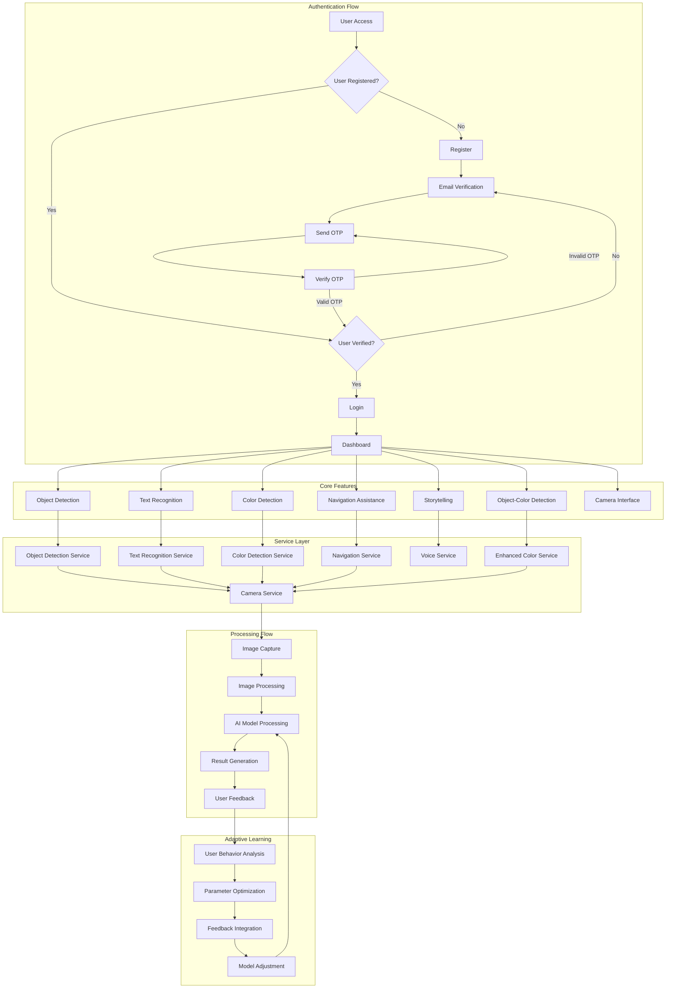

# Blind Vision - Application Workflow Diagram

## Detailed Workflow Description

### Authentication System
1. **User Registration**
   - User provides username, email, and password
   - System generates OTP and sends verification email
   - User enters OTP to verify email
   - Upon verification, account is activated

2. **Login Process**
   - User enters credentials
   - System verifies credentials
   - Upon success, user is directed to dashboard

### Feature Workflows

#### Object Detection
1. User accesses object detection feature
2. Camera is activated to capture real-time images
3. Images are processed through detection models
4. Objects are identified with position information
5. Results are presented to user through visual UI and voice feedback

#### Text Recognition
1. User activates text recognition feature
2. Camera captures image of text
3. OCR processing extracts text content
4. Extracted text is formatted and optimized
5. Text is presented visually and read aloud to user

#### Color Detection
1. User selects color detection feature
2. Camera captures images in real-time
3. Color analysis algorithms identify predominant colors
4. Color names and descriptions are generated
5. Results are communicated through visual and audio channels

#### Navigation Assistance
1. User activates navigation guidance
2. System captures environment through camera
3. Path calculation algorithms analyze obstacles and safe routes
4. Direction guidance is generated with safety warnings
5. Instructions are delivered through voice commands and visual cues

### Data Flow Architecture
- **Frontend Layer**: HTML templates with accessibility enhancements
- **Application Layer**: Flask routes and controllers managing requests
- **Service Layer**: Specialized services for each feature domain
- **Model Layer**: AI and algorithmic processing components
- **Database Layer**: User data, preferences, and session information

### Adaptive Learning System
- Tracks user behavior patterns
- Analyzes feature usage and effectiveness
- Optimizes parameters based on user feedback
- Adjusts models to improve accuracy and relevance
- Personalizes experience according to user preferences

## Communication Pathways
- **User → System**: Input through camera, voice commands, and UI interactions
- **System → User**: Output through accessible visual UI and voice feedback
- **Between Services**: Internal API calls and data sharing through standardized formats
- **External APIs**: Integration with cloud services for enhanced processing capability 